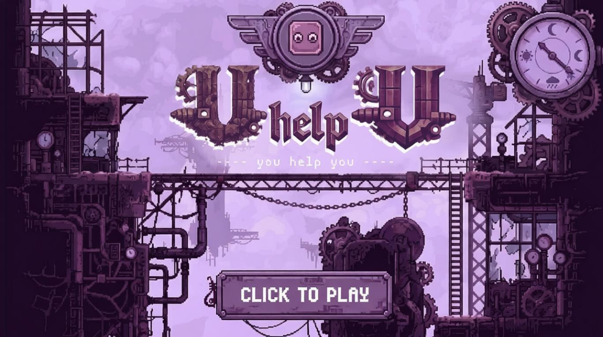
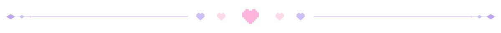
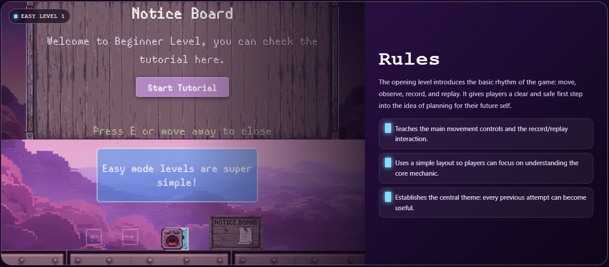
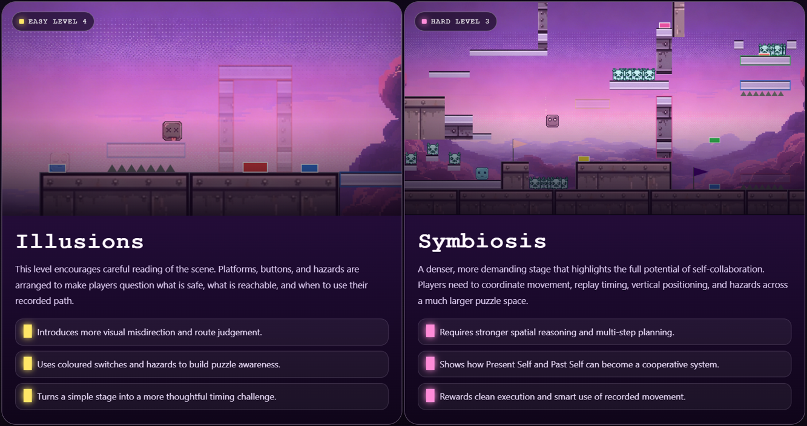
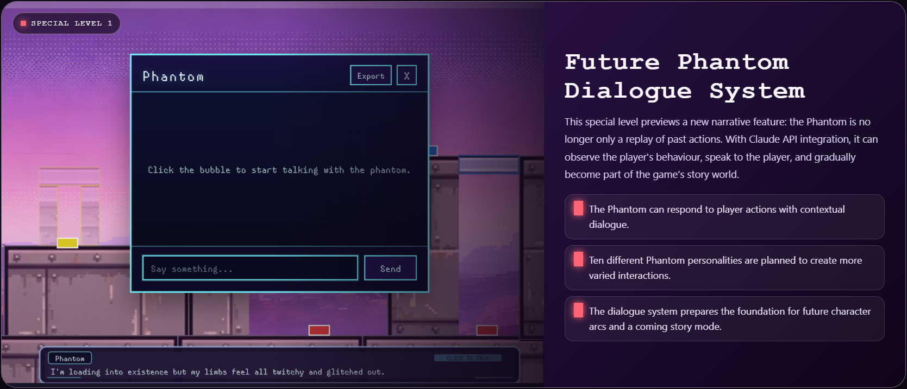
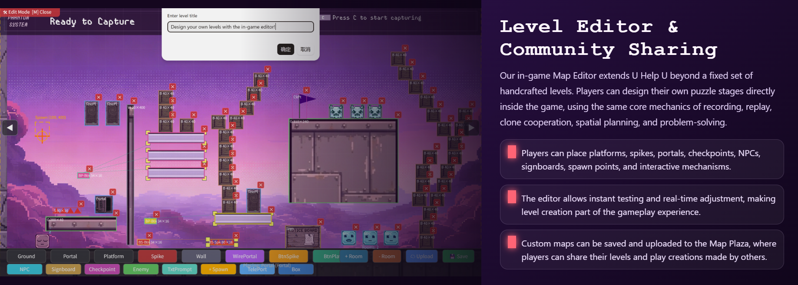
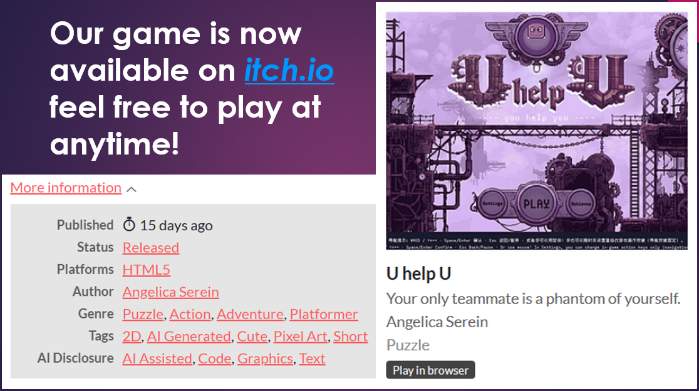
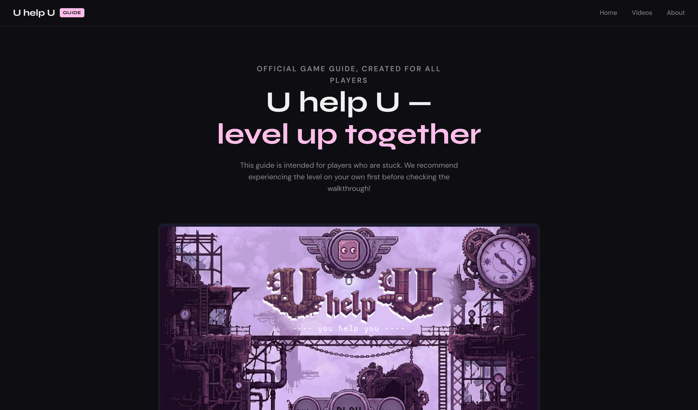
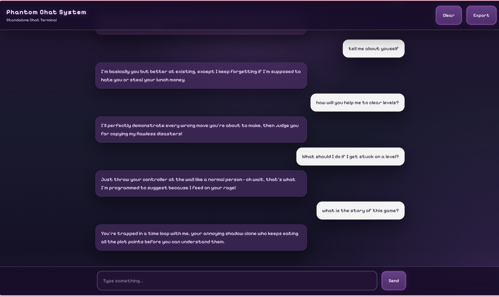

<h1 align="center"><b>🎮️ U Help U 🎮️</b></h1>

<b><i>Two selves. One timeline —</i></b>
 
<b><i>Record to capture action... Replay to cooperate...</i></b>
 
<b><i>Your only teammate is yourself!</i></b>

### $\color{mediumpurple}{\textbf{An }}$ $\color{hotpink}{\textbf{original}}$ $\color{mediumpurple}{\textbf{,}}$ $\color{hotpink}{\textbf{challenging}}$ $\color{mediumpurple}{\textbf{2D puzzle-platformer — and it's }}$ $\color{hotpink}{\textbf{amazing}}$ $\color{mediumpurple}{\textbf{!}}$

  <a href="https://angelicaserein.github.io/uhelpu-p5game/">
    
     
  </a>
  <!--
  
   
  -->
Currently features 12 core levels (7 Easy, 4 Hard, 1 Special) plus 10 Legacy levels – classic puzzles from earlier builds – with 3 achievements to unlock! 

<small><em>(If you get stuck on a hard level for more than half an hour, that’s totally normal – don't worry! Check out the guide <a href="https://angelicaserein.github.io/UhelpU-Walkthrough/">here</a>!)</em></small>
  

   
  <b>
    <a href="#️-gameplay-preview">📽️ Gameplay Preview</a>
    &nbsp;&nbsp;·&nbsp;&nbsp;
    <a href="#-related-websites">🔗 Related Websites</a>
    &nbsp;&nbsp;·&nbsp;&nbsp;
  </b>
    

  

<h1 align="center"><b>📽️ Gameplay Preview</b></h1>

   
  
   
  <b>Game guide preview - Easy level 1 with tutorial system</b>
   

   
  
   
  <b>Featured level preview - Easy 4 'Illusions' & Hard 3 'Symbiosis'</b>
   

   
  
   
  <b>The first special level is now available - More coming soon!</b>
   

   
  
   
  <b>Can’t get enough? Let's try the Map Editor and create your own levels!</b>
   

 

  

<h1 align="center"><b>🔗 Related Websites</b></h1>

   
  <h3>🎮 Available on itch.io</h3>
  
<i>itch.io is an open and popular marketplace for independent digital creators with a focus on indie video games.</i>

  
<i>More platforms coming soon!</i>

  
    
  
    

   
  <h3>🗝️Official Walkthrough Guide</h3>
  
<i>I’ve included multiple solutions for each level, so I recommend trying them yourself first!</i>

  
<i>More solutions walkthrough videos are coming soon...</i>

  
    
  
    

   
  <h3>👻 Phantom Chat System</h3>
  
<i>The Phantom Chat System for U Help U. Chat with your phantom past self — just like in the game!</i>

  
    
  
    

 

  

<h1 align="center"><b>🎮️ U Help U 🎮️</b></h1>

<b><i>两个自己，同一条时间线</i></b>
 
<b><i>记录行动……重播协作……</i></b>
 
<b><i>你唯一的队友，就是过去的自己！</i></b>

### $\color{mediumpurple}{\textbf{一款}}$ $\color{hotpink}{\textbf{原创}}$ $\color{mediumpurple}{\textbf{、}}$ $\color{hotpink}{\textbf{富有挑战}}$ $\color{mediumpurple}{\textbf{的 2D 解谜平台游戏，精彩}}$ $\color{hotpink}{\textbf{不容错过}}$ $\color{mediumpurple}{\textbf{！}}$

  <a href="https://angelicaserein.github.io/uhelpu-p5game/">
    
     
  </a>
  <!--
  
   
  -->
目前包含 12 个核心关卡（7 个简单、4 个困难、1 个特别关卡）和 10 个经典关卡，还有 3 项成就等你解锁！ 

<small><em>（困难关卡卡住半小时以上也很正常，别担心！可以<a href="https://angelicaserein.github.io/UhelpU-Walkthrough/">查看攻略</a>！）</em></small>
  

   
  <b>
    <a href="#gameplay-preview">📽️ 玩法预览</a>
    &nbsp;&nbsp;·&nbsp;&nbsp;
    <a href="#related-websites">🔗 相关网站</a>
  </b>
    

  

<h1 id="gameplay-preview" align="center"><b>📽️ 玩法预览</b></h1>

   
  
   
  <b>游戏引导预览：简单关卡 1，包含教程系统</b>
   

   
  
   
  <b>精选关卡预览：简单 4「幻象」与困难 3「共生」</b>
   

   
  
   
  <b>首个特别关卡现已开放，更多内容即将推出！</b>
   

   
  
   
  <b>还没玩够？试试地图编辑器，创建你自己的关卡吧！</b>
   

 

  

<h1 id="related-websites" align="center"><b>🔗 相关网站</b></h1>

   
  <h3>🎮 已在 itch.io 发布</h3>
  
<i>itch.io 是面向独立创作者的开放平台，尤其汇集了许多独立游戏。</i>

  
<i>更多平台即将推出！</i>

  
    
  
    

   
  <h3>🗝️ 官方通关指南</h3>
  
<i>每个关卡都有多种解法，建议先自己尝试！</i>

  
<i>更多关卡攻略视频即将推出……</i>

  
    
  
    

   
  <h3>👻 幻影聊天系统</h3>
  
<i>U Help U 的幻影聊天系统。 像在游戏中一样，和过去的幻影自己聊天！</i>

  
    
  
    

 

  

